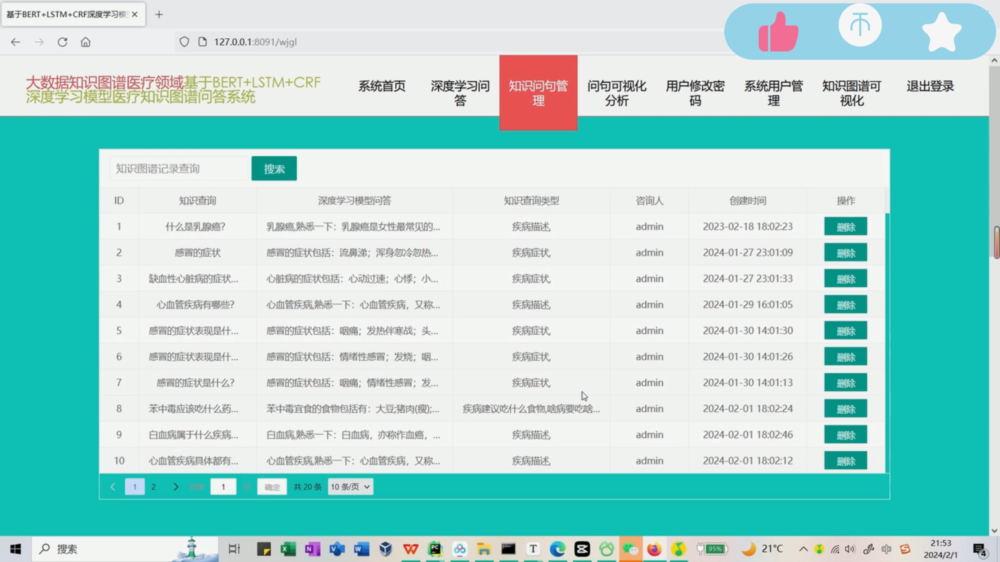

## 计算机毕业设计吊炸天Python医疗问答系统 医疗可视化 BERT+LSTM+CRF深度学习识别模型 机器学习 深度学习 爬虫 知识图谱 人工智能 大数据毕设

## 要求
### 源码有偿！一套(论文 PPT 源码+sql脚本+教程)

### 
### 加好友前帮忙start一下，并备注github有偿医疗问答系统
### 我的QQ号是2827724252或者798059319或者 1679232425或者微信:bysj2023nb

# 

### 加qq好友说明（被部分 网友整得心力交瘁）：
    1.加好友务必按照格式备注
    2.避免浪费各自的时间！
    3.当“客服”不容易，repo 主是体面人，不爆粗，性格好，文明人。
## 介绍
知识图谱是将知识连接起来形成的一个网络。由节点和边组成，节点是实体，边是两个实体的关系，节点和边都可以有属性。知识图谱除了可以查询实体的属性外，还可以很方便的从一个实体通过遍历关系的方式找到相关的实体及属性信息。
BERT是一种基于Transformer 架构的预训练语言模型，能够捕捉双向上下文信息。BERT 模型在大规模语料上进行预训练，然后可以通过微调来适应特定任务,BERT 可用于处理输入文本，提取丰富的语义信息。它可以用于文本的编码和表征学习，以便更好地理解医学问答中的问题和回答。LSTM 是一种递归神经网络（RNN）的变体，专门设计用于处理序列数据。它通过使用门控机制来捕捉长期依赖关系，适用于处理时间序列和自然语言等序列数据。 LSTM 可以用于处理医学文本中的序列信息，例如病历、症状描述等。它有助于保留文本中的上下文信息，提高模型对长文本的理解能力。CRF 是一种用于标注序列数据的统计建模方法。在序列标注任务中，CRF 能够考虑标签之间的依赖关系，从而更好地捕捉序列结构。 在医学文本中，CRF 可以用于命名实体识别（NER）任务，例如识别疾病、药物、实验室结果等实体。通过引入CRF层，可以提高标签之间的一致性和整体序列标注的准确性。
基于BERT+LSTM+CRF深度学习识别模型医疗知识图谱问答可视化系统通过构建医疗领域的知识图谱来实现计算机的深度学习，并且能够实现自动问答的功能。本次的内容研究主要是通过以Python技术来对医疗相关内容进行数据的爬取，通过爬取足量的数据来进行知识图谱的的搭建，基于Python语言通过echarts、Neo4j来实现知识图谱的可视化。通过智慧问答的方式构建出以BERT+LSTM+CRF的深度学习识别模型，从而完成对医疗问句主体的识别，构建出数据集以及实现文本的训练。通过Django来进行web网页的开发，通过面向用户的网页端开发使用来满足用户医疗问答的需要。通过该系统设计一个强大的问答模块，能够接受用户输入的自然语言问题，并基于Aho-Corasick算法、贪心算法及深度学习模型BERT、LSTM、CRF等深度学习算法模型生成准确的、语义一致的回答。
## 演示视频
https://www.bilibili.com/video/BV1giqJYrEV6
## 运行截图

